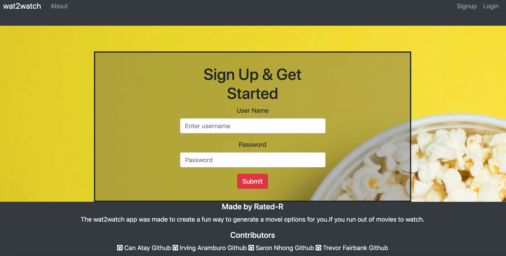
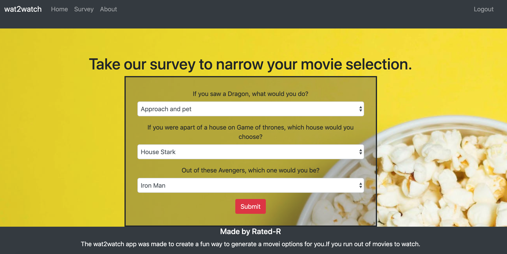
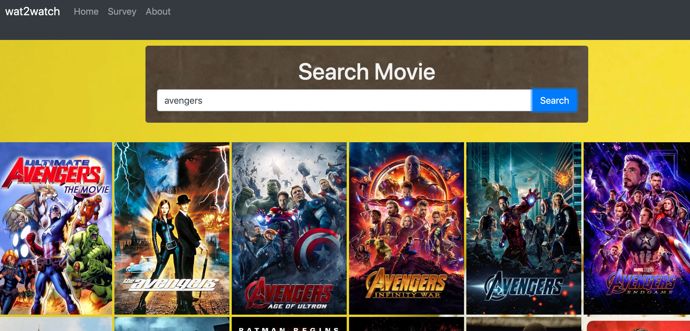
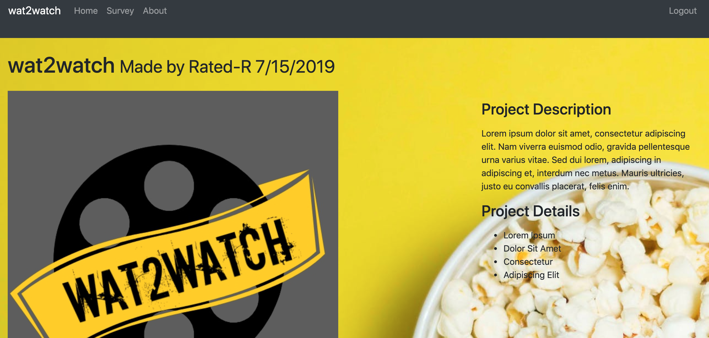

# Wat2Watch App
## Overview
Wat2Watch is a full stack application that collects information through surveys and favorited movies, stores and analyzes it in a MySQL database, and gives the user recommendations for movies that they would like.

## Usage
Wat2Watch runs in the browser window and is deployed on Heroku. To start, go to https://movie-generator.herokuapp.com/ and create a new user to log into the application. After the new user is created and logged in, the user will be directed to answer a few questions on a survey. Based on these results, the app will recommend movies for the user to watch. The user is also able to add any movies to their favorites list. Information from the favorites list is stored in a MySql database. The app will analyze the the stored information and recommend more movies to the user when the page is reloaded. The more information the application is able to collect, the more accurate the recommendations will be. 

## Examples
### Images:

Screenshot of the Login page

Screenshot of the Survey page

Screenshot of the Home page

Screenshot of the About page

## Technologies
Wat2Watch was created using these technologies
* JavaScipt
* Node.js
* MySql
* API
    * The Movie Database API
* NPM JS Packages
    * Bcrypt
    * Dotenv
    * Express
    * Express Handlebars
    * Express Session
    * Morgan
    * MySQL 2
    * Passport
    * Sequelize
    * Unirest

## GITHUB
[github link](https://github.com/vinirg22/movie_gen)

